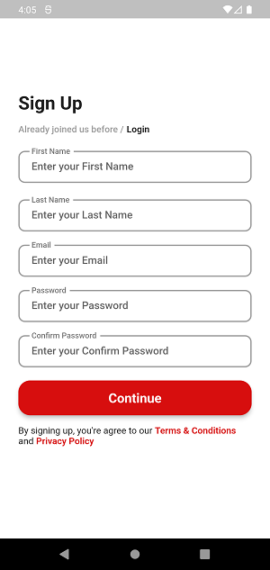

# Flutter-Reciping.id

A recipe mobile application created using Flutter and consuming public API from https://github.com/tomorisakura/unofficial-masakapahariini-api

## Feature

This application aims to make it easier for mobile users to find recipes quickly and precisely. Not only search but this application also offers a feature to save favorite recipes so that later the user can see their favorite recipes easily.

## Package used in

- dio: ^4.0.6
- provider: ^6.0.2
- path: ^1.8.0
- firebase_core: ^1.16.0
- firebase_auth: ^3.3.17
- cloud_firestore: ^3.1.14
- fluttertoast: ^8.0.9
- firebase_storage: ^10.2.15
- image_picker: ^0.8.5+2
- shimmer: ^2.0.0
- shared_preferences: ^2.0.15

## Some app screenshots

### SplashScreen

### LoginScreen

### RegisterScreen

### HomeScreen

### DetailRecipeScreen

### SearchScreen

### SearchNotFoundScreen

### ArticleScreen

### FavouriteScreen

### ProfileScreen

### ProfileEditScreen
